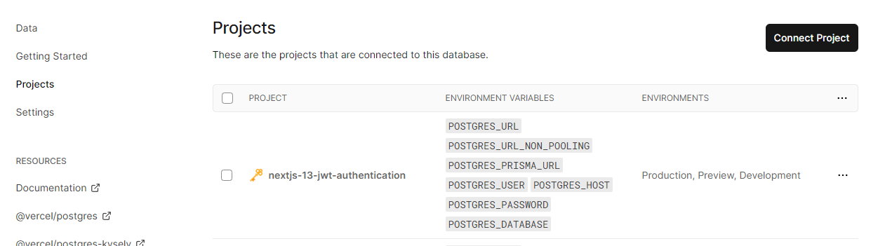

<div align="center">
<h1 align="center">

<br>
nextjs-13-JWT-authentication
</h1>

<p align="center">


</p>


</div>

---

## 📍 Overview
This project helps me quickly familiarize and review [middleware](https://nextjs.org/docs/app/building-your-application/routing/middleware) in Next.js 13, JWS and others JWT-related RFCs in [jose](https://github.com/panva/jose), basic concepts in [prisma](https://www.prisma.io/docs/concepts/overview/what-is-prisma), and usage of [Vercel Postgre](https://vercel.com/docs/storage/vercel-postgres).

---

## 🚀 Getting Started

### 🖥 Installation

1. Clone the nextjs-13-JWT-authentication repository:

```sh
git clone https://github.com/ttpss930141011/nextjs-13-JWT-authentication
```

2. Change to the project directory:

```sh
cd nextjs-13-JWT-authentication
```

3. Install the dependencies:

```sh
npm install
```

### 🤖 Using nextjs-13-JWT-authentication

#### Development

```sh
npm run dev
```

#### Production

```sh
npm run prod
```

#### Deployment
- Deploy project on Vercel by clicking the following buttom.  
<a href="https://vercel.com/new/clone?repository-url=https://github.com/ttpss930141011/nextjs-13-JWT-authentication&env=NEXT_PUBLIC_JWT_SECRET_KEY,NEXT_PUBLIC_JWT_EXPIRES_IN,NEXT_PUBLIC_BACKEND_URL"></a>

- Create a Vercel Postgre database in [here](https://vercel.com/storage/postgres).
- Vercel Postgre connects to Vercel project. It will add env variables automatically.

- Done!

## 📄 License

This project is licensed under the MIT License. See the [LICENSE](https://docs.github.com/en/communities/setting-up-your-project-for-healthy-contributions/adding-a-license-to-a-repository) file for additional info.
